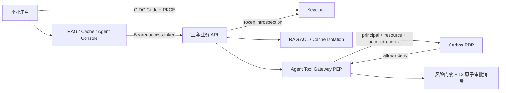

# 企业访问控制平面

三套 BaseOps 项目共用的企业内部访问控制基座：

- [多模态基站运维 RAG](https://github.com/BeefWrap4/basestation-multimodal-rag)
- [AI 应用缓存中间件](https://github.com/BeefWrap4/llm-cache-middleware)
- [基站智能运维 Agent Harness + Plugins](https://github.com/BeefWrap4/basestation-agent-harness)

- Keycloak 26.7.0 负责 OIDC/SSO 和粗粒度角色。浏览器使用 Authorization Code + PKCE，后端通过标准 Token Introspection 校验访问令牌、受众与有效期。
- Cerbos 0.54.0 负责 Agent Tool Gateway 的调用级 ABAC。策略使用版本化 YAML 管理，PDP 不可用时 Tool Gateway fail-closed。
- 业务授权保留在业务边界：RAG 文档 ACL、缓存 workspace/subject 隔离、Agent L3 审批原子消费均不下沉到 IAM。



## 本地开发账号

这些账号仅用于本地导入的 `baseops` Realm，不得复用于其他环境。

| Purpose | Username | Password | Realm roles |
| --- | --- | --- | --- |
| requester/admin | `ops-user` | `Ops-demo-2026!` | `ops`, `admin` |
| independent reviewer | `reviewer-user` | `Reviewer-demo-2026!` | `approver` |
| negative test | `viewer-user` | `Viewer-demo-2026!` | `viewer` |
| tenant isolation test | `other-workspace-user` | `Other-demo-2026!` | `ops` |

服务到服务身份使用独立 Client Credentials：`aegra-worker` 仅面向 `agent-backend`，`agent-mcp` 仅面向 `rag-backend`，不复用浏览器用户 Token。

## 启动与验证

```powershell
docker compose up -d
powershell -ExecutionPolicy Bypass -File scripts/verify.ps1
python scripts/benchmark_access_control.py --requests 200 --concurrency 20
```

Keycloak 地址为 `http://localhost:8180`，管理健康端口为 `9000`；Cerbos HTTP/gRPC 端口为 `3592/3593`。三套业务应用应先启动本控制平面，再启动各自 Compose。

`verify.ps1` 同时校验 Keycloak/Cerbos 健康、三套 API 的身份正向链路、无 Token/无角色负向链路、跨 workspace 隔离和 Cerbos allow/deny。性能脚本只记录当前单机复现环境的延迟与错误率，不代表生产 SLO。

`qa-client` 的密码模式只用于确定性 API 验证；三个生产形态的浏览器 Client 均未开启密码模式，必须使用 PKCE。生产部署还应通过 Secret Manager 注入密钥，并将 Keycloak、Cerbos 与数据库切换为高可用部署。
